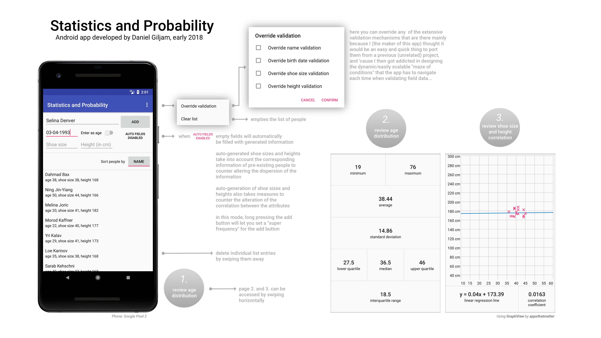

# IA-1-001 (0) Statistics and Probability

An Android app that displays statistical and average dispersion metrics based on a list of people.

Made in the course "Statistik och sannolikhet (2017-18) (IA-1-001 (0))" at [Arcada University of Applied Sciences](https://www.arcada.fi/en).

---

